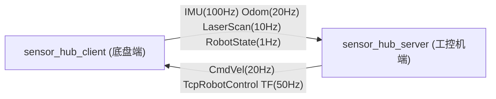
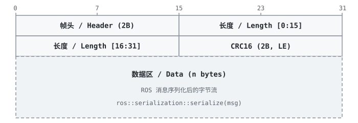

# sensor_hub_client

## 背景

该项目来源于任务 RCSS-3319（支持基于 TCP 的 IMU、ODOM、激光接入协议），是 Autoxing 机器人底盘软件系统的一部分。

在机器人系统中，传感器数据（IMU、里程计、激光雷达）通常由底盘端采集，而决策与计算在工控机端执行。为支持**第三方传感器接入**和**跨网络数据传输**，定义了一套基于 TCP 的二进制协议，将 ROS 消息序列化后在底盘（client）与远程服务器（server）之间双向传输。

**sensor_hub_client** 运行在底盘端，负责：

- 订阅底盘 ROS 话题（IMU、Odom、LaserScan、硬件状态），序列化后通过 TCP 上报给 server
- 接收 server 下发的控制指令（轮速控制、锁松轮、TF），反序列化后发布到 ROS 话题

对应的服务端为 **sensor_hub_server**，运行在远程主机上，接收传感器数据并发布为 ROS 话题，同时将控制命令回传。



---

## 协议格式

所有消息采用统一的帧结构：

| 名称   | 类型         | 说明                        |
| ------ | ------------ | --------------------------- |
| 帧头   | 原码，2 字节 | 标识消息类型                |
| 长度   | 原码，4 字节 | 数据区长度（不含帧头、CRC） |
| CRC    | 原码，2 字节 | 数据区 Modbus CRC-16        |
| 数据区 | 原码         | ROS 消息序列化后的字节流    |

<div align="center">
  
</div>

ROS 消息使用 `ros::serialization::serialize` / `deserialize` 进行序列化和反序列化。

### 上报消息（Client → Server）

| 消息      | 帧头       | 频率   | ROS 话题                            | 序列化类型             |
| --------- | ---------- | ------ | ----------------------------------- | ---------------------- |
| IMU       | 0xAB, 0xCD | 100 Hz | `/imu`                              | `sensor_msgs/Imu`      |
| Odom      | 0xAB, 0xCE | 20 Hz  | `/odom_origin`                      | `nav_msgs/Odometry`    |
| LaserScan | 0xAB, 0xCF | 10 Hz  | `/ax_laser_scan`                    | `cln_msgs/AxLaserScan` |
| 机器状态  | 0xAB, 0xD0 | 1 Hz   | `/hardware_state` → `TcpRobotState` | 自定义 msg             |

### 下发消息（Server → Client）

| 消息               | 帧头       | ROS 话题（发布） | 序列化类型                                  |
| ------------------ | ---------- | ---------------- | ------------------------------------------- |
| 轮速控制（CmdVel） | 0xBA, 0xE2 | `/cmd_vel`       | `geometry_msgs/Twist`                       |
| 锁松轮指令         | 0xBA, 0xE1 | `/automode_ctrl` | `TcpRobotControl` → `cln_msgs/HardwareCtrl` |
| TF                 | 0xBA, 0xE3 | TF broadcast     | `tf2_msgs/TFMessage`                        |

### 扩展消息

该协议支持以下扩展消息，用于不同底盘厂商的差异化需求：

**客户端上报（Client → Server）：**

| 消息              | 帧头       | 帧率  |
| ----------------- | ---------- | ----- |
| PortingOdom       | 0x4F, 0x4D | 20 Hz |
| 轮子硬件状态      | 0x44, 0x53 | 1 Hz  |
| ScanMatchedPoints | 0xBA, 0xE4 | —     |

**服务端下发（Server → Client）：**

| 消息        | 帧头       | 帧率  |
| ----------- | ---------- | ----- |
| PortingOdom | 0x41, 0x42 | 20 Hz |
| TrackedPose | 0x50, 0x4F | 50 Hz |

**互斥关系：**

- `Odom` 和 `PortingOdom` 互斥
- `TF` 和 `TrackedPose` 互斥

---

## Topic 约定

| 方向 | 话题              | 类型                     | 说明                            |
| ---- | ----------------- | ------------------------ | ------------------------------- |
| 订阅 | `/imu`            | `sensor_msgs/Imu`        | IMU 原始数据                    |
| 订阅 | `/odom_origin`    | `nav_msgs/Odometry`      | 原始里程计                      |
| 订阅 | `/ax_laser_scan`  | `cln_msgs/AxLaserScan`   | 激光雷达扫描                    |
| 订阅 | `/hardware_state` | `cln_msgs/HardwareState` | 硬件状态（电量、手动/自动模式） |
| 发布 | `/cmd_vel`        | `geometry_msgs/Twist`    | 轮速控制指令                    |
| 发布 | `/automode_ctrl`  | `cln_msgs/HardwareCtrl`  | 锁松轮指令                      |
| 广播 | TF                | `tf2_msgs/TFMessage`     | map → odom → base_link 坐标变换 |

---

## 启动方法

```bash
source devel/setup.bash

# 直接运行
rosrun sensor_hub_client sensor_hub_client

# 或用 launch 文件（默认 server: 172.17.0.2:8091）
roslaunch sensor_hub_client client.launch
```

### 参数

| 参数        | 类型   | 默认值      | 说明             |
| ----------- | ------ | ----------- | ---------------- |
| `host_ip`   | string | `127.0.0.1` | 远程 server IP   |
| `host_port` | int    | `8091`      | 远程 server 端口 |

---

## 项目结构

```
sensor_hub_client/
├── CMakeLists.txt
├── package.xml
├── README.md
├── launch/
│   └── client.launch          # ROS launch 文件
├── msgs/
│   ├── TcpRobotControl.msg    # 锁松轮控制消息定义
│   └── TcpRobotState.msg      # 机器人状态消息定义
├── refer/
│   ├── client_debug.py        # Python 调试客户端（用于测试）
│   └── imu_odom_sim.py        # IMU/Odom 仿真器（用于测试）
└── src/
    ├── main.cpp               # 入口，初始化 ROS 节点
    ├── sensor_hub_client.h    # Client 类声明
    ├── sensor_hub_client.cpp  # Client 类实现（核心逻辑）
    ├── tcp_stream.h / .cpp    # TCP 连接管理（socket 封装，自动重连）
    ├── tcp_pack.h / .cpp      # TCP 协议帧解析（帧头匹配 + CRC 校验）
    ├── packet_parser.h        # 通用帧解析器框架（ParserManager）
    ├── crc.h / .cpp           # CRC-16 校验
```
