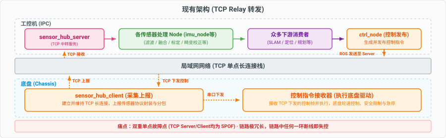
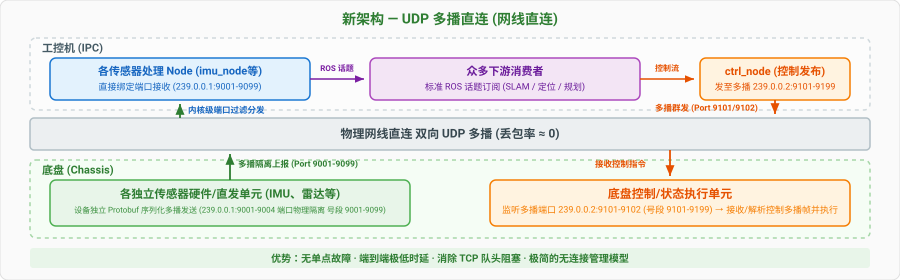

# Sensor Hub — UDP 多播直连架构设计

> **状态**: 草案  
> **目标**: 用 UDP 多播替代现有 TCP client/server relay 架构，实现传感器数据与控制的端到端直连

---

## 1. 动机

### 1.1 现有架构的问题

<div align="center">
  
</div>

- **双重单点故障 (Double SPOFs) 与断流风险**：IPC 端的 `sensor_hub_server` 和底盘端的 `sensor_hub_client` 均为单点故障瓶颈。任何一端或连接崩溃，整个上下行通路即刻瘫痪。
- **链路冗长/传输低效**：数据经过底盘串口采集、Client 打包、TCP 网络发送、Server 接收、解包、ROS 内部话题分发，存在多次重复的序列化/反序列化和进程间通信（IPC）。
- **TCP 队头阻塞**：雷达/点云的大包一旦发生重传，会强行阻塞高频的 IMU/里程计等小数据包，引发控制延迟。
- **连接管理极其复杂**：为了防止 TCP 半开连接与虚假存活，需实现复杂的断线自动重连、双向心跳检测等上层应用逻辑。

### 1.2 简化路径

<div align="center">
  
</div>

新架构去除了集中式中继的 TCP `sensor_hub_server` (IPC 端) 以及集中的代理 `sensor_hub_client` (底盘端)，从源头上彻底消除双重单点故障：

- **无中心化 Client**：底盘各物理传感器（如 IMU、雷达）或微控制器硬件模块被设计为独立的“直发单元”。只要能够实现或烧录符合 Protobuf 标准协议规范的多播逻辑，即可各自往 UDP 多播地址独立、高效发布数据，独立传感器之间逻辑彻底解耦。
- **无中心化 Server**：工控机端由对应的算法/前置处理 Node (如 `imu_node`、`laser_node` 等) 直接加入网卡多播组。它们零中转直接接收底层设备发布的原始 Protobuf 包，并在内部滤波、畸变校正等核心计算后，转存为标准 ROS 格式分发给下游 slam/定位等消费者。

### 1.3 可行性基础

- **网线直连**：底盘与工控机之间是物理网线直连，无交换机/路由器，UDP 丢包率可视为零
- **持续状态信号模型**：所有命令（含急停）均为高频循环发送的状态量，而非一次性事件。丢一帧等下一帧（10–100ms），对控制无影响
- **安全兜底**：接收端超时未收到数据自动进入安全态，比依赖 TCP 断连检测更可靠

---

## 2. 整体架构

在新的 UDP 多播直连架构中（见上图 1.2 简化路径），整体数据及控制拓扑由两条核心多播管道支撑：

- **底盘 → 工控机 (传感器组播 IP `239.0.0.1`，端口 `9001`–`9099` 按传感器类型隔离)**：
  - 承载底盘各物理传感器直发单元上报的原始传感器包。
  - 原始多播包由对应的传感器前置处理 Node (如 `imu_node`、`laser_node` 等) 零拷贝直接接收，并在节点内部完成解合包、时间戳对齐、高频滤波或畸变消除等算法加工。
  - 完成滤波后的高品质数据再通过标准 ROS 话题 (如 `/imu/data`, `/scan`) 散发给下游众多消费者 (SLAM/定位/监控等)。

- **工控机 → 底盘 (控制组播 IP `239.0.0.2`，端口 `9101`–`9199` 按指令类型隔离)**：
  - 规划控制决策节点（如 `wheel_control_node`）产生控制帧后，直接向组播组群发，无需中介 Server。
  - 底盘端的控制多播执行和驱动接收模块直接加入多播组逻辑，按需接收并解析该多播帧进行驱动执行，也无需经过代理 Client 中转。

---

## 3. 多播通道划分与数据流

### 3.1 端口物理隔离设计 (避免用户态无效收包)

在以太网多播中，如果所有设备使用相同的多播 IP 和端口（例如 `239.0.0.1:9001`），虽然可以通过 Protobuf `Envelope` 的 `MessageType` 在用户态过滤包，但**低频、高带宽的雷达大包分片会高频触发 IMU 接收节点的 socket 唤醒与 read 拷贝**。这不仅徒增工控机 CPU 负荷，还会导致 IMU 接收发生抖动或延迟。

为了实现**内核级数据分流与零用户态干扰**，新架构设计了“**多播 IP 相同 + 端口按传感器物理隔离**”的通信划分：

端口号采用两段式划分，便于肉眼识别方向且留有充足扩展空间：

- **上行号段 `9001`–`9099`**：传感器数据（底盘 $\rightarrow$ 工控机），多播 IP `239.0.0.1`
- **下行号段 `9101`–`9199`**：控制指令（工控机 $\rightarrow$ 底盘），多播 IP `239.0.0.2`

#### 底盘 → 工控机 端口与多播通道划分（`239.0.0.1`，号段 `9001`–`9099`）：

| 数据类别                  | 端口      | 期望频率 | 典型单包大小  | 对应接收处理器 (进行滤波处理并发布 ROS Topic) |
| ------------------------- | --------- | -------- | ------------- | --------------------------------------------- |
| **IMU 数据**              | 9001      | 100 Hz   | < 100 B       | `imu_node`                                    |
| **Odom 里程计数据**       | 9002      | 20 Hz    | < 300 B       | `wheel_control_node`                          |
| **Laser 激光雷达数据**    | 9003      | 10 Hz    | 1400 B (分片) | 雷达驱动                                      |
| **底盘硬件状态/外设监测** | 9004      | 1 Hz     | < 100 B       |                                               |
| _预留_                    | 9005–9099 | —        | —             | 未来新增传感器类型                            |

### 3.2 工控机 → 底盘（`239.0.0.2`，号段 `9101`–`9199`）

底盘各执行单元或驱动层分别监听特定控制端口，避免不必要的轮询干扰：

| 指令/控制类型       | 端口      | 期望频率 | 典型大小 | 说明                             |
| ------------------- | --------- | -------- | -------- | -------------------------------- |
| **CmdVel 轮速指令** | 9101      | 20 Hz    | < 50 B   | 轮速控制目标值                   |
| LockRelease         | 9101      | 10 Hz    | < 50 B   | 锁松轮状态指令                   |
| EmergencyStop       | 9101      | 10 Hz    | < 20 B   | 急停状态（高频循环发送，非事件） |
| TF 下发             | 9102      | 50 Hz    | < 300 B  | map→odom→base_link 变换          |
| PortingOdom         | 9102      | 20 Hz    | < 300 B  | 下发里程计参考                   |
| TrackedPose         | 9102      | 50 Hz    | < 100 B  | 与 TF 互斥                       |
| _预留_              | 9103–9199 | —        | —        | 未来新增指令类型                 |

> **说明**：CmdVel、LockRelease、EmergencyStop 共用端口 9101 是基于实际考虑——控制指令包极小（< 50 B），即使三者在同一端口到达，用户态按 `MessageType` 过滤的开销可忽略。反之若为每种指令单独开端口，反而徒增底盘端 socket 数量和端口管理复杂度。对性能有更高要求的指令（如 50Hz 的 TF/PortingOdom）则独立走 9102 端口隔离。

---

## 4. 序列化：Protocol Buffers

### 4.1 选择理由

- 自带前向兼容（新增字段不破坏旧接收端）
- 跨语言（底盘端 C++，上位机可能是 Python/C++/Go 均可消费）
- 生态成熟，无需依赖 ROS 消息定义文件

### 4.2 消息格式设计

每个 UDP 数据报承载一个 `Envelope` 消息：

```protobuf
// 单个 UDP 负载 = 一个 Envelope
message Envelope {
  MessageType type = 1;
  uint32 sequence = 2;      // 单调递增序号，用于丢帧检测
  bytes payload = 3;        // 对应具体消息的序列化结果
}

enum MessageType {
  MSG_IMU = 1;
  MSG_ODOM = 2;
  MSG_LASER_SCAN_FRAGMENT = 3;  // 点云分片
  MSG_ROBOT_STATE = 4;
  MSG_CMD_VEL = 5;
  MSG_LOCK_RELEASE = 6;
  MSG_EMERGENCY_STOP = 7;
  MSG_TF = 8;
  MSG_PORTING_ODOM = 9;
  MSG_TRACKED_POSE = 10;
  MSG_WHEEL_HARDWARE_STATE = 11;
}
```

### 4.3 线缆帧格式

每个 UDP 数据报的负载格式如下：

```
| magic (2B) | CRC-16 (2B) | protobuf Envelope (变长) |
| 0xAB 0x01  |             |                          |
```

- **magic** (`0xAB 0x01`)：用于快速过滤非本协议数据包。接收端 recvfrom 后先检查前 2 字节，不匹配直接丢弃，避免将第三方广播包送入 protobuf 解析。
- **CRC-16**：覆盖 protobuf Envelope 部分，防止 bit-flip（网线直连概率极低，但工业场景不容有失）。
- **protobuf Envelope**：变长，即 4.2 节定义的 `Envelope` 消息的序列化结果。

构造流程（发送端）：

```cpp
// 1. 序列化 payload → Envelope
Imu imu;
imu.set_timestamp_ns(sensor_timestamp);
imu.set_ax(0.1);
// ...
Envelope env;
env.set_type(MSG_IMU);
env.set_sequence(++seq);
imu.SerializeToString(env.mutable_payload());

// 2. 一次性分配完整缓冲区：[magic(2)][crc(2)][Envelope(变长)]
size_t env_size = env.ByteSizeLong();
std::vector<uint8_t> frame(4 + env_size);
frame[0] = 0xAB;
frame[1] = 0x01;
env.SerializeToArray(frame.data() + 4, env_size);

uint16_t crc = crc16(frame.data() + 4, env_size);
frame[2] = static_cast<uint8_t>(crc >> 8);
frame[3] = static_cast<uint8_t>(crc & 0xFF);
// sendto(frame.data(), frame.size()) 到多播地址
```

具体消息定义（Proto3 示例）：

```protobuf
message Pose {
  double x = 1;     // 位置 x (m)
  double y = 2;     // 位置 y (m)
  double z = 3;     // 位置 z (m)
  double qx = 4;    // 四元数 x
  double qy = 5;    // 四元数 y
  double qz = 6;    // 四元数 z
  double qw = 7;    // 四元数 w
}

message Imu {
  uint64 timestamp_ns = 1; // 采集时刻 (ns)
  double ax = 2;           // 线加速度 (m/s²)
  double ay = 3;
  double az = 4;
  double gx = 5;           // 角速度 (rad/s)
  double gy = 6;
  double gz = 7;
}

message Odom {
  uint64 timestamp_ns = 1; // 采集时刻 (ns)
  double vx = 2;           // 线速度 x (m/s)
  double vy = 3;           // 线速度 y (m/s)
  double vz = 4;           // 线速度 z (m/s)
  double wx = 5;           // 角速度 x (rad/s)
  double wy = 6;           // 角速度 y (rad/s)
  double wz = 7;           // 角速度 z (rad/s)
  Pose pose = 8;           // 3D 位姿 (位置 + 四元数)
}

message CmdVel2D {
  double vx = 1;    // 线速度 (m/s)
  double vy = 2;    // 横向 (m/s)，差速底盘为 0
  double vtheta = 3;// 角速度 (rad/s)
}

message EmergencyStop {
  bool stopped = 1;  // true = 急停激活中
}

message RobotState {
  uint64 timestamp_ns = 1; // 采集时刻 (ns)
  double battery_voltage = 2;
  double battery_percentage = 3;
  bool auto_mode = 4;
  // ...
}
```

### 4.4 构造与解析流程

**发送端：**

```cpp
Imu imu;
imu.set_ax(0.1);
// ... 填充字段 ...

Envelope env;
env.set_type(MSG_IMU);
env.set_sequence(++seq);
imu.SerializeToString(env.mutable_payload());

// 预计算序列化大小，一次性分配完整缓冲区：[magic(2)][crc(2)][Envelope]
size_t env_size = env.ByteSizeLong();
std::vector<uint8_t> frame(4 + env_size);
frame[0] = 0xAB;
frame[1] = 0x01;
env.SerializeToArray(frame.data() + 4, env_size);

uint16_t crc = crc16(frame.data() + 4, env_size);
frame[2] = static_cast<uint8_t>(crc >> 8);
frame[3] = static_cast<uint8_t>(crc & 0xFF);

sendto(sock, frame.data(), frame.size(), 0, &multicast_addr, sizeof(multicast_addr));
```

**接收端（imu_node）：**

```cpp
char buf[65536];
ssize_t n = recvfrom(sock, buf, sizeof(buf), 0, nullptr, nullptr);
if (n < 0) {
    // 接收错误，略过
    return;
}

// 检查 magic 字节
if (n < 4 || buf[0] != 0xAB || buf[1] != 0x01) {
    // 非本协议包，直接丢弃
    return;
}

// 校验 CRC-16
uint16_t recv_crc = (static_cast<uint16_t>(buf[2]) << 8) | static_cast<uint16_t>(buf[3]);
uint16_t calc_crc = crc16(buf + 4, n - 4);
if (calc_crc != recv_crc) {
    // CRC 校验失败，丢弃
    return;
}

Envelope env;
env.ParseFromArray(buf + 4, n - 4);

if (env.type() == MSG_IMU) {
    Imu imu;
    imu.ParseFromString(env.payload());
    // 直接使用 imu 数据，无需再走 rostopic
    process(imu);
}
```

---

## 5. 点云分片机制

### 5.1 设计原则

- 每个 UDP 数据报 ≤ 1400 字节（IPv4 多播 MTU 安全阈值，为 IP/UDP 头留出余量）
- 一个分片 = 一个自描述的 Envelope，包含一组连续的点
- 接收端按 `scan_sequence` + `fragment_index` 拼装整帧

### 5.2 分片结构

```protobuf
message LaserScanFragment {
  uint32 fragment_index = 1;       // 当前分片序号 (0-based)
  uint32 total_fragments = 2;      // 总分片数
  uint32 scan_sequence = 3;        // 整帧序列号（同一帧的所有分片共享）
  uint64 scan_timestamp_ns = 4;    // 整帧的时间戳

  // 本分片包含的点（proto3 下 repeated 标量默认 packed，无需显式标注）
  repeated float ranges = 5;     // 距离值 (m)
  repeated float angles = 6;     // 角度 (rad)
  repeated float intensities = 7;// 强度 (可选)
}
```

### 5.3 分片策略

```
假设一帧 LaserScan 有 1080 个点，每个点 (range + angle) ≈ 8 字节
总大小 ≈ 1080 × 8 = 8640 字节

以每个分片 200 个点为上限 → 6 个分片
分片 0: 点 0–199    (≈ 1600 字节序列化后 ≈ 1 个 UDP 包)
分片 1: 点 200–399
...
分片 5: 点 1000–1079
```

### 5.4 接收端重组

```cpp
struct ScanAssembly {
    uint32_t scan_seq;
    uint64_t timestamp_ns;
    uint32_t total_fragments;
    std::vector<bool> received;
    std::vector<float> all_ranges;
    std::vector<float> all_angles;
    ros::Time first_fragment_time;
};

// 收到分片时：
//   1. 检查 scan_sequence，如果是新帧则清空旧缓冲区
//   2. 存入对应位置
//   3. 标记 received[fragment_index] = true
//   4. 如果 all received → 输出完整点云
//   5. 如果 first_fragment_time 距今 > 100ms → 丢弃不完整帧
```

---

## 6. 安全机制

### 6.1 控制指令超时保护（底盘端）

底盘持续监控来自多播组 `239.0.0.2`（端口 9101–9102）的控制指令：

```
| 指令         | 期望频率 | 超时阈值 | 超时行为                     |
| ------------ | -------- | -------- | ---------------------------- |
| CmdVel       | 20 Hz    | 200 ms   | 速度归零，停止运动           |
| EmergencyStop| 10 Hz    | 200 ms   | 触发急停                     |
| LockRelease  | 10 Hz    | 500 ms   | 保持当前锁定状态（保守策略） |
```

---

## 7. Socket 配置要点

### 7.1 发送端

```cpp
int sock = socket(AF_INET, SOCK_DGRAM, 0);

// 允许发送多播
// (Linux 默认允许，无需额外设置)

// 设置多播 TTL = 1（同一子网内）
int ttl = 1;
setsockopt(sock, IPPROTO_IP, IP_MULTICAST_TTL, &ttl, sizeof(ttl));

// 禁用多播回环（自己发的自己不会收到）
int loop = 0;
setsockopt(sock, IPPROTO_IP, IP_MULTICAST_LOOP, &loop, sizeof(loop));

// 绑定发送接口（多网卡场景）
struct in_addr iface;
inet_aton("192.168.1.100", &iface); // 底盘网口 IP
setsockopt(sock, IPPROTO_IP, IP_MULTICAST_IF, &iface, sizeof(iface));

// 发送
struct sockaddr_in addr = {};
addr.sin_family = AF_INET;
addr.sin_port = htons(9001);
inet_aton("239.0.0.1", &addr.sin_addr);
sendto(sock, data, len, 0, (struct sockaddr*)&addr, sizeof(addr));
```

### 7.2 接收端

```cpp
int sock = socket(AF_INET, SOCK_DGRAM, 0);

// 地址复用（同一端口允许多个接收端）
int reuse = 1;
setsockopt(sock, SOL_SOCKET, SO_REUSEADDR, &reuse, sizeof(reuse));

// 绑定多播端口
struct sockaddr_in addr = {};
addr.sin_family = AF_INET;
addr.sin_port = htons(9001);
addr.sin_addr.s_addr = INADDR_ANY;
bind(sock, (struct sockaddr*)&addr, sizeof(addr));

// 加入多播组
struct ip_mreq mreq;
inet_aton("239.0.0.1", &mreq.imr_multiaddr);
inet_aton("192.168.1.200", &mreq.imr_interface); // 工控机网口 IP
setsockopt(sock, IPPROTO_IP, IP_ADD_MEMBERSHIP, &mreq, sizeof(mreq));

// 接收 buffer 尺寸（IMU 100Hz 完全够用）
int rcvbuf = 256 * 1024;
setsockopt(sock, SOL_SOCKET, SO_RCVBUF, &rcvbuf, sizeof(rcvbuf));

// 循环接收
char buf[65536];
recvfrom(sock, buf, sizeof(buf), 0, nullptr, nullptr);
```

### 7.3 阻塞带超时接收

所有接收端使用单独线程阻塞接收，配合 100ms socket 超时，避免轮询浪费 CPU：

```cpp
// 设置 100ms 接收超时
struct timeval tv = { .tv_sec = 0, .tv_usec = 100000 };
setsockopt(sock, SOL_SOCKET, SO_RCVTIMEO, &tv, sizeof(tv));

// 单独线程阻塞接收
void receiver_thread() {
  char buf[65536];
  while (running) {
    int n = recvfrom(sock, buf, sizeof(buf), 0, nullptr, nullptr);
    if (n > 0) {
      process(buf, n);
    } else if (n < 0 && errno == EAGAIN) {
      // 超时无数据，继续循环
      continue;
    }
  }
}
```

---

## 8. 与旧架构对比

| 维度             | 旧 (TCP relay)                                                         | 新 (UDP 多播)                   |
| ---------------- | ---------------------------------------------------------------------- | ------------------------------- |
| 延迟             | ROS 序列化→反序列化 + TCP 组帧→解析 + ROS 序列化→反序列化，共 **6 次** | PB 序列化→反序列化，共 **2 次** |
| 组件数           | 4 (sender, client, server, consumer)                                   | 2 (sender, consumer)            |
| 故障点           | client/server 单点                                                     | 无单点                          |
| 队头阻塞         | TCP 导致                                                               | 不存在                          |
| 连接管理         | 需要断线重连/心跳                                                      | 无连接                          |
| 调试可见性       | server 可做 rostopic echo                                              | 需额外监听节点                  |
| 序列化           | ROS msg 序列化                                                         | Protocol Buffers                |
| 跨语言           | 依赖 ROS 客户端库                                                      | 仅需 protobuf                   |
| 安全性（丢指令） | 依赖 TCP                                                               | 超时安全态 + 高频循环发送       |
